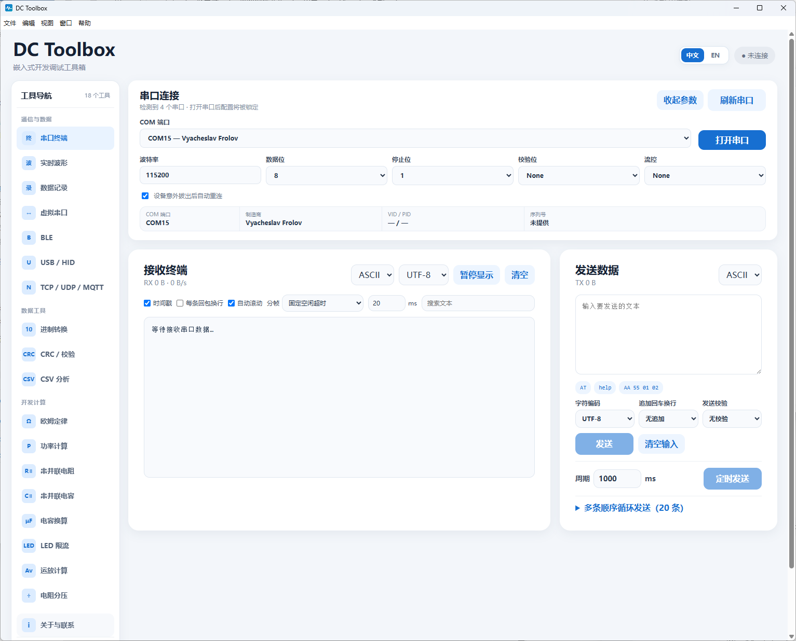
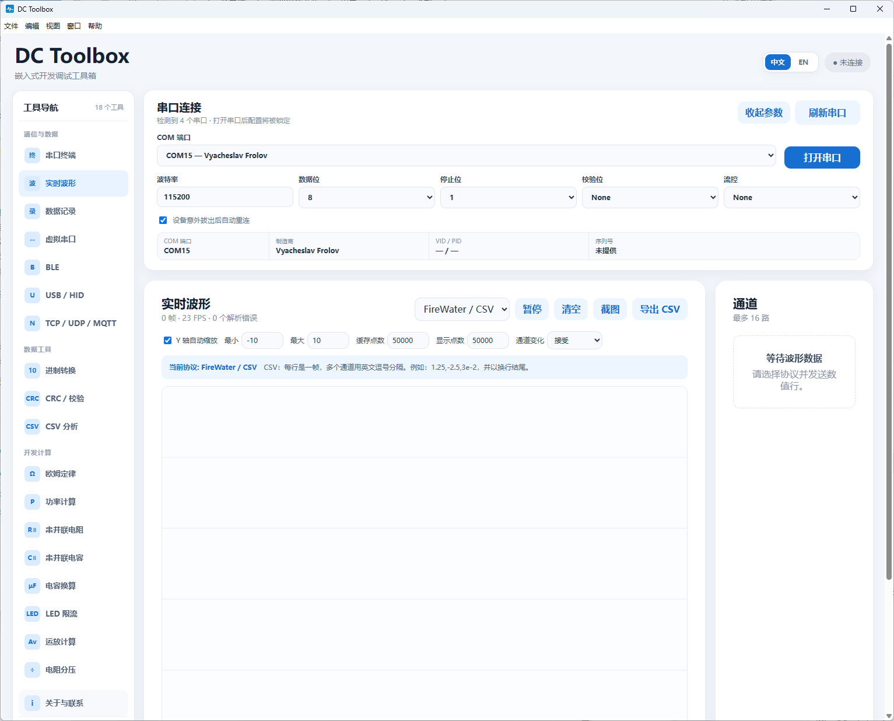
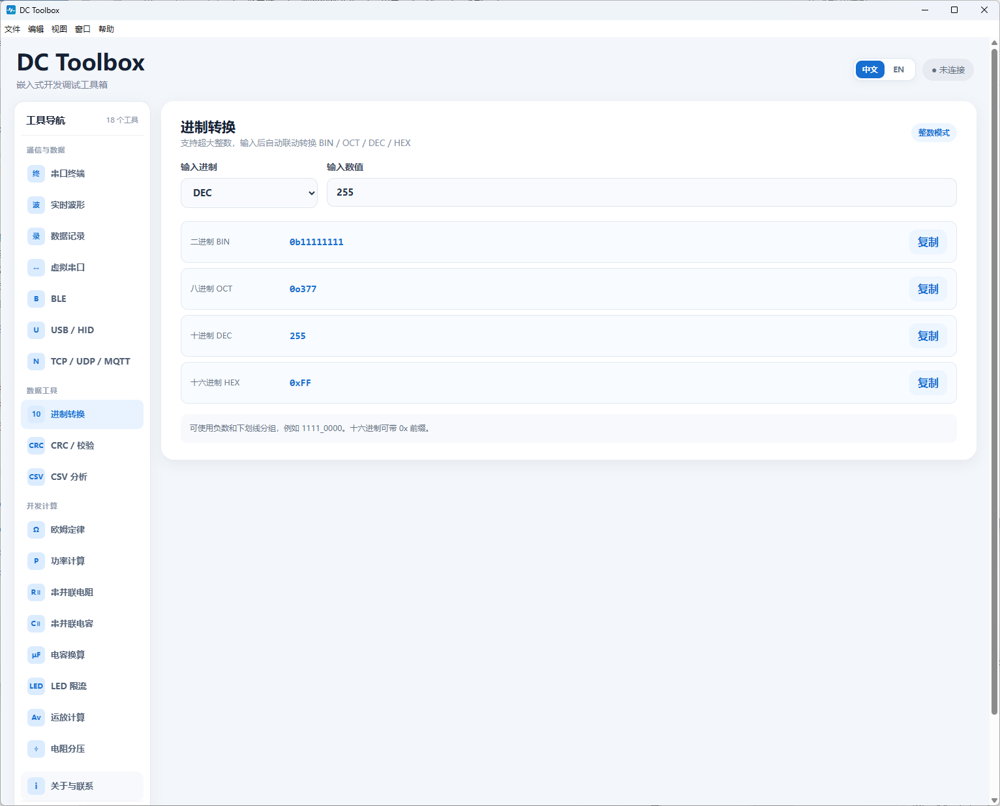
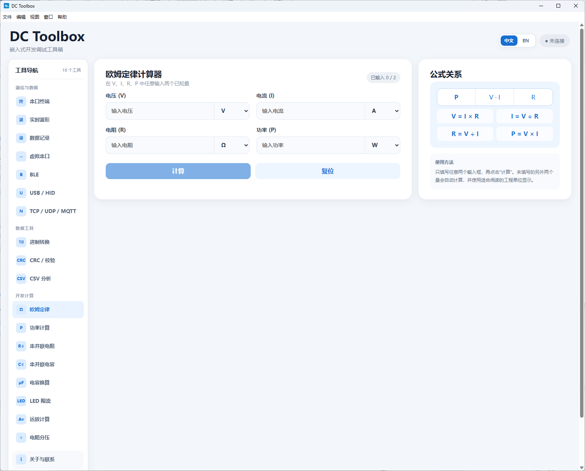
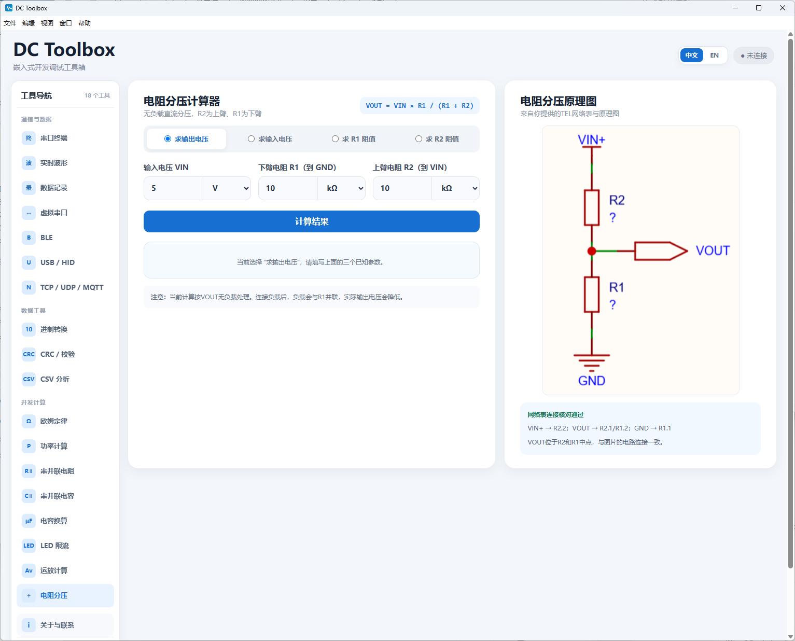

# DC Toolbox

面向嵌入式开发工程师的 Windows 开发调试工具箱。当前包含串口终端、实时波形和数据记录模块，使用 Electron、Vue 3、TypeScript 和 SerialPort 构建。

界面采用可扩展的分类侧边栏导航；全屏时工作区使用全部可用宽度，窄窗口时导航自动切换为可横向滚动的紧凑模式。Windows原生菜单已中文化。

> 完整的操作范围、输入格式和模块完成状态请参阅 [功能说明](docs/FEATURES.md)。

## 界面预览

| 串口终端 | 实时波形 |
| --- | --- |
|  |  |

| 进制转换 | 欧姆定律 |
| --- | --- |
|  |  |

### 电阻分压计算器



## 联系与交流

- 作者邮箱：`2192994528@qq.com`
- QQ群：`698749242`
- 群名：`DC Toolbox 嵌入式开发交流群`
- GitHub：<https://github.com/lyj2192994528-del/DC-Toolbox>

群介绍：欢迎加入 DC Toolbox 嵌入式开发交流群。本群面向 MCU 开发、硬件设计、串口调试、波形分析和电子计算工具交流。可以反馈 DC Toolbox 使用问题、提交功能建议、分享调试经验与开源项目。请友善交流，禁止广告、引流和无关内容。

工具采用 `src/tools/<工具名>/` 模块目录和统一工具注册表，详细扩展方法见 `src/tools/README.md`。

## 已完成功能

- 扫描串口并显示端口、制造商、VID/PID 和序列号
- 配置波特率、数据位、停止位、校验位和流控，支持自定义波特率
- 串口打开、关闭、异常断开提示和自动重连
- ASCII/HEX 收发、UTF-8/GBK/Latin-1 编码、时间戳、回包合并、暂停显示、搜索、收发计数和发送历史
- LF、CR、LF+CR、CR+LF 尾缀，SUM8/XOR8/CRC16-Modbus 校验和定时发送
- ASCII、HEX、BIN、DEC 多格式发送；20 条起步、最多 100 条的可扩展顺序循环发送
- 接收支持自适应/固定空闲超时分帧，也可按 LF、CR 或 CRLF 分帧换行
- DTR、RTS、Break 流控信号控制
- 网页媒体下载：粘贴公开 HTTPS 网页地址，通过经官方 SHA-256 校验的 yt-dlp 组件解析并下载最佳兼容视频或原始音频
- 欧姆定律计算器：在电压、电流、电阻、功率中任意输入两个，计算其余两个并支持常用工程单位
- 同相运放计算器：根据 R1、R2、VIN 计算闭环增益和输出，检查输出饱和并按目标增益反算电阻
- 电阻分压计算器：可选择求VIN、VOUT、上臂R2或下臂R1，并计算分压比例、静态电流及电阻功耗
- 功率计算器：支持直流、纯阻性负载、单相/三相交流功率及效率换算，并可反算电压、电流、电阻和输入输出功率
- 串并联电阻计算器：最多100个电阻动态增删与批量选择，计算串联/并联等效阻值，并可按目标总阻值反算缺失电阻
- 串并联电容计算器：最多100个电容动态增删，支持串联/并联等效容值及缺失电容反算
- 电容换算器：pF、nF、μF、mF、F实时互换并生成常用三位电容代码
- LED串联电阻计算器：支持多颗串联LED，推荐E24标准电阻与安全功率档位
- CSV、NamedData、JustFloat 三种实时波形协议
- 最多 16 通道，1～50000 点缓存/显示，滚轮缩放、拖动、通道显隐、改名、颜色、统计和截图
- 原始串口数据记录（BIN + JSON 元数据）与波形 CSV 导出
- 串口参数、窗口位置和自定义波特率持久化；损坏配置自动恢复
- Windows x64 安装包和免安装便携版
- 双击后优先显示独立的软件图标、版本号和加载动画，随后展示联系方式欢迎窗口；主窗口采用适中尺寸而非全屏

## 开发命令

```powershell
npm install
npm run dev
npm run typecheck
npm test
npm run test:loopback
npm run test:performance
npm run test:storage
npm run dist:win
```

`test:loopback` 默认测试 `COM10 @ 115200`，要求该串口处于自发自收状态，并且运行测试前关闭应用中的串口连接。

## 波形数据格式

CSV（每行一帧）：

```text
1.25,-2.5,3e-2
```

NamedData（逗号或空格分隔，冒号或等号均可）：

```text
voltage:3.30,current=0.125,power:0.4125
```

JustFloat：连续发送小端 Float32 通道数据，每帧末尾追加字节 `00 00 80 7F`。通道数需在波形面板中设置。

## 发布文件

- `artifacts/DC Toolbox-1.1.3-x64-Setup.exe`：Windows 安装程序
- `artifacts/DC Toolbox-1.1.3-x64-Portable.exe`：免安装便携版

当前发布未进行商业代码签名，Windows 首次运行时可能显示安全提示。
当前包含串口终端、实时波形、数据记录、进制转换、CRC/校验、CSV 分析及常用电子计算工具。界面支持简体中文和 English，可在首次欢迎窗口或“视图 → 语言”中切换。串口接收默认使用固定 20 ms 空闲超时分帧，连续高速数据最迟每 100 ms 刷新一次。BLE、USB/HID、TCP/UDP/MQTT 已建立独立模块入口，等待接入真实 Windows 底层能力。

## 虚拟串口

DC Toolbox 可以检测并打开已安装的 [com0com 官方项目](https://sourceforge.net/projects/com0com/) 管理工具，用虚拟端口对完成无硬件串口回环测试。com0com 是独立的第三方 GPLv2 内核驱动，本项目不打包、不修改也不静默安装该驱动。

建议仅安装与当前 Windows 版本兼容且具有有效数字签名的版本。不要为了安装旧驱动而关闭 Secure Boot 或开启 Windows 测试签名模式。

## 网页媒体下载组件

网页媒体解析由独立开源项目 [yt-dlp](https://github.com/yt-dlp/yt-dlp) 提供。正式安装包已内置官方 Windows x64 程序，无需首次下载；用户也可以主动选择“更新 / 修复组件”，软件仅在用户点击后从官方 GitHub Release 下载，并依据官方 `SHA2-256SUMS` 校验 `yt-dlp.exe`。软件不会强制或静默更新组件。第三方项目说明见 [THIRD_PARTY_NOTICES.md](THIRD_PARTY_NOTICES.md)。

哔哩哔哩、YouTube 等网站通常分别提供视频轨和音频轨。正式安装包已内置经过官方 SHA-256 校验的 FFmpeg-Builds Windows x64 LGPL 组件，可自动下载并合并为 MP4，无需首次安装。用户仍可主动选择“更新 / 修复 FFmpeg”，软件不会强制或静默更新。

该功能不支持 DRM、付费墙、私人内容或权限绕过。请只下载你有权保存和使用的公开内容，并遵守网站条款和当地法律。
